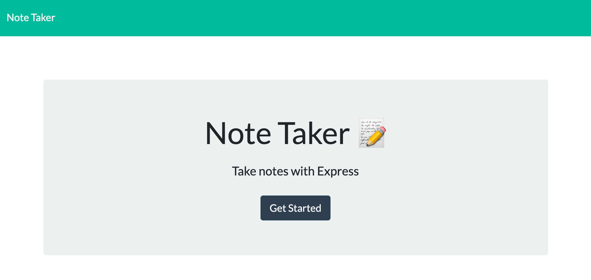

# Note Taker 

## Description 
I have created an application designed to write, save, and delete notes. This application allows the user to organize and refer to their tasks and to-do lists. 

</>

## Table of Contents
- [Installation](#installation)
- [Usage](#usage)
- [License](#license)
- [Contributions](#contributions)
- [Tests](#tests)
- [Questions](#questions) 
  

## Installation
The user will need to have node express installed prior to running the app. 

## Usage
The user can access the Note Taker application via Heroku - https://notetaker1212.herokuapp.com/. 

## License
Notice: This is licensed under MIT.

## Contributions 
Contributions can be made by forking the Github repository below. 

## Tests 
Node tests were performed on this application.

## Questions
Please feel free to view my GitHub profile at https://github.com/jeniglar or email me directly at jeniglar@gmail.com with any additional questions.
